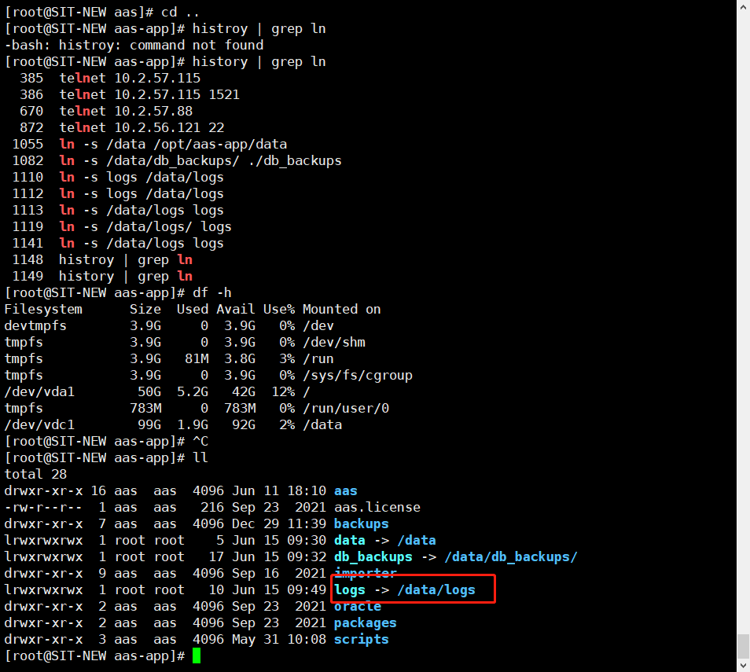

# 挂载磁盘
1. * 软链文件夹到已挂载的磁盘
```shell
  # 查看已挂载的文件
  mount  或者
  df -h
```
  
```shell
  # 在 /data 目录下创建要挂载的文件夹，以logs为例
  cd /data
  mkdir logs
  # 将原来 logs 文件夹的内容都移到 /data/logs 下，避免数据丢失
  mv /logs/* /data/logs/
  # 删除原 logs 文件
  rmdir logs
  # 创建软链
  ln -s /data/logs ./logs  (这里最好使用绝对路径)
```
  
2. * 将磁盘直接挂载到要备份的目录下 
  