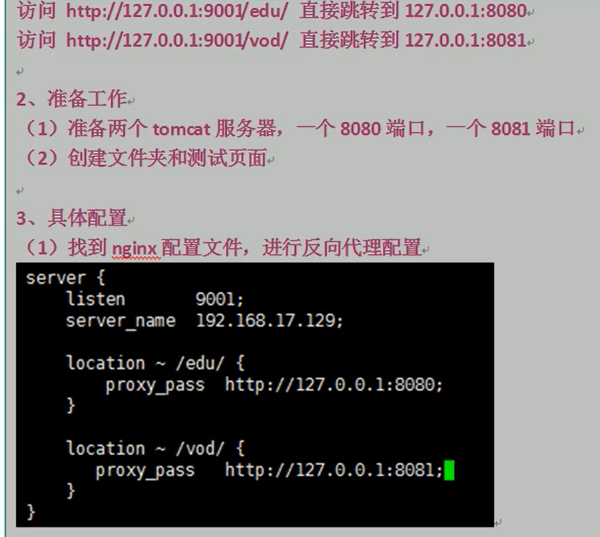

# nginx基本概念
1. * 简介
> 高性能， 高并发
2. * 基本概念
> 反向代理：
>> 将请求发送到反向代理服务器，然后反向代理服务器访问服务器，反向代理服务器是为了服务器代理的，客户端并不知道真实的服务器的地址

> 正向代理：
>> 浏览器通过代理服务器访问服务器，代理服务器是为浏览器代理的

> 负载均衡：
>> 增加服务器数量，将请求平均分发到不同服务器上

> 动静分离
>> 前端静态资源和动态资源分开进行部署
3. * nginx配置文件组成
> 全局块（开始到events之前）
nginx 服务器整体运行的配置
worker_process 1; ` # nginx 处理并发的数量`

> events块
nginx 服务器与用户的网络连接
worker_connection; ` # nginx 最大的连接数`

> http块
>> http 全局块
>> server 块
listen 80;  `# 目前监听80端口`
server_name localhost;  `# 主机名称（本地是localhost）`
location / {}  `# 路径跳转 路径包含某个值进行配置`
4. * 常用命令
  + 必须到nginx的目录下  
  `cd /usr/local/nginx/sbin`
  + 查看版本号  
  `./nginx -v`
  + 启动  
  `./nginx`
  + 关闭  
  `./nginx -s stop`
  + 重新加载  
  `./nginx -s reload`
5. * 配置实例
  + 反向代理
  